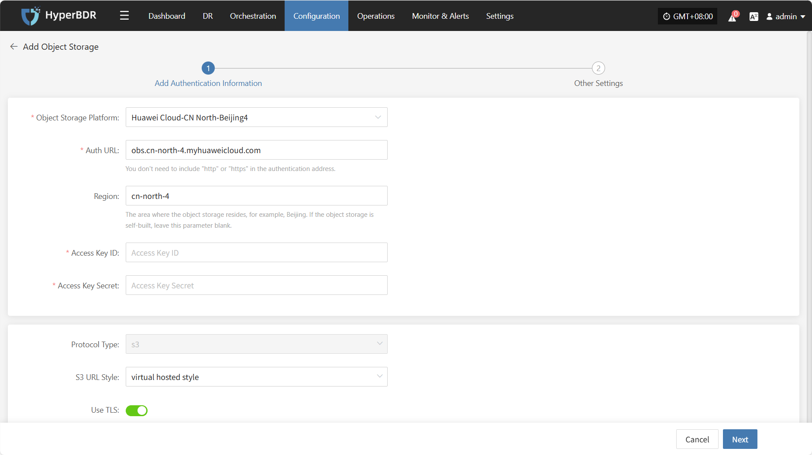
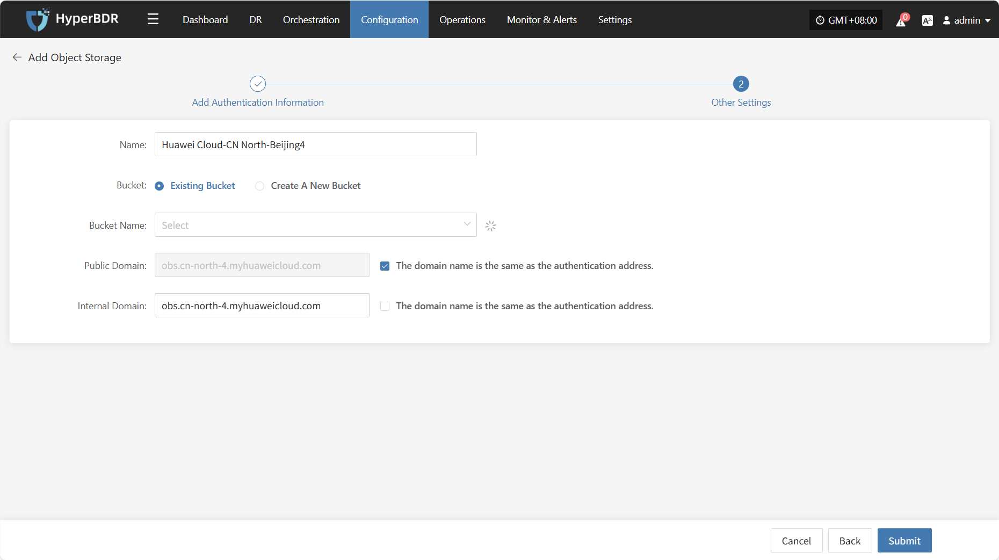
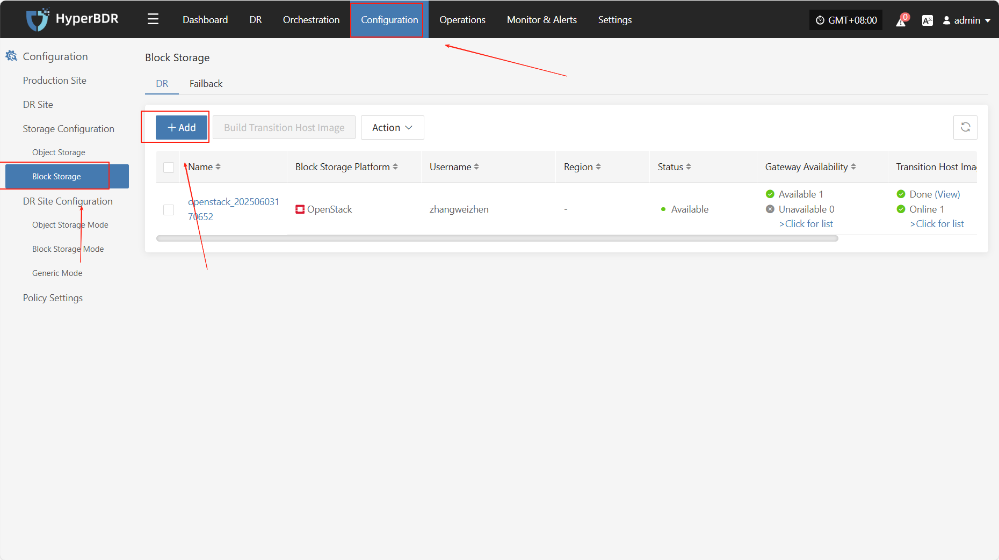

# **Storage Configuration**
Defines the target storage for data during DR or backup. The system currently supports the following types of storage configurations.

## **Object Storage**

### **Supported Cloud Platforms**

| Cloud Vendor         |
|:----------------------:|
| Other Platforms        |
| Alibaba Cloud        |
| AWS                  |
| ctyun JC             |
| ecloud               |
| ecloud JC            |
| GDS                  |
| HCS Online           |
| Huawei Cloud         |
| Open Telekom Cloud (SDK v3.1.86) |
| Tencent Cloud        |
| TM CAE               |
| Volcengine           |

You can refer to the following 'Configuration Example' to complete the related setup. This article uses Huawei Cloud configuration as an example.

### **Configuration Example**

#### **Add Huawei Cloud**

From the top navigation bar, select **"Configuration" → "Storage Configuration" → "Object Storage"** to enter the object storage page. Click the **"Add"** button to add a new object storage configuration.

##### **Add Authentication Information**

On the object storage configuration page, select **"Huawei Cloud"** as the platform type, then choose the required region (such as East China, North China, etc.). Fill in the following authentication information according to your actual environment:

| Field               | Example Value                        | Description                                    |
| ------------------- | ------------------------------------ | ---------------------------------------------- |
| Object Storage Platform | Huawei Cloud-CN North-Beijing4    | Select from the dropdown list, e.g. "Huawei Cloud-North China-Beijing 4" |
| Auth URL            | obs.cn-north-4.myhuaweicloud.com     | Authentication service address, do not add `http://` or `https://` prefix |
| Region              | cn-north-4                           | The region where the object storage is located, e.g. `beijing`. Leave blank for self-built storage |
| Access Key ID       | ygOfXlSs2F4rYBmO                     | Access key ID for object storage               |
| Access Key Secret   | ••••••••••••••••••••••••••           | Corresponding access key secret, hidden by default, used for authentication only |
| Protocol Type       | s3                                   | Specify the object storage protocol type, currently only `s3` is supported |
| S3 URL Style        | path style / virtual hosted style    | Select the S3 access style                     |
| Use TLS             | Yes / No                             | Whether to enable encrypted transmission (HTTPS), choose according to your needs |

##### **Other Settings**

After completing the authentication information, click **"Next"** to continue configuring the bucket-related parameters and finish connecting the object storage.

| **Field**      | **Example Value**         | **Description**                                                                                                   |
| -------------- | ------------------------ | ----------------------------------------------------------------------------------------------------------------- |
| Name           | Huawei Cloud-North China-Beijing 4 | The name of the selected object storage platform. By default, it is the platform name chosen in the first step.   |
| Bucket         | Existing Bucket / New Bucket | Choose how to create the bucket: select an existing bucket or create a new one.                                   |
| Bucket Name    | As appropriate            | If you select an existing bucket, choose from the dropdown list; if creating a new bucket, enter the name manually. Note: Custom names must be no more than 10 characters, using only numbers and lowercase letters. If left blank, the system will generate one automatically. Note: For Tencent Cloud as the target platform, APPID must be entered. |
| Public Domain  | As appropriate            | The address for public network access to the bucket. You can customize it or check "Same as Auth Domain Name".    |
| Internal Domain| As appropriate            | The address for internal network access to the bucket. You can customize it or check "Same as Auth Domain Name".  |

## **Block Storage**

### **Add Block Storage**

From the top navigation bar, select **"Configuration" → "Storage Configuration" → "Block Storage"** to enter the block storage page. Click the **"Add"** button in the upper right corner to add a new block storage configuration.

You can click the "Configuration Guide" link next to each cloud platform in the list to view detailed operation steps.

### **Supported Cloud Platforms**

| Cloud Vendor                                 | Notes   |
|----------------------------------------------|---------|
| Alibaba Cloud                               |[Click to View](../dr-site-configuration-block/alibaba.md)         |
| Alibaba Cloud Apsara Stack (v3.16.x)        |         |
| Alibaba Cloud Apsara Stack (v3.18.x)        |         |
| AWS China (SDK v1.34.93)                    |[Click to View](../dr-site-configuration-block/aws.md)         |
| AWS (SDK v1.34.93)                          |         |
| ecloud                                      |         |
| ecloud JC                                   |         |
| eSurfingCloud4.0                            |         |
| FiXo Cloud BS                               |         |
| Google Cloud (SDK v1.19.0)                  |[Click to View](../dr-site-configuration-block/google.md)         |
| GridCloud                                   |         |
| Huawei Cloud Stack Online (v23.3)           |         |
| Huawei Cloud Stack (HCS) (v8.2.x/v8.3.x)    |         |
| Huawei Cloud (Recommended, SDK v3.1.86)     |[Click to View](../dr-site-configuration-block/huawei.md)         |
| Jinshan Cloud                               |         |
| Microsoft Azure (SDK v30.3)                 |[Click to View](../dr-site-configuration-block/azure.md)         |
| Open Telekom Cloud (SDK v3.1.86)            |         |
| OpenStack Community (Uno+)                  |[Click to View](../dr-site-configuration-block/openstack.md)         |
| Oracle Cloud (SDK v2.126.3)                 |         |
| QingCloud                                   |         |
| SMTX OS (v6.x.x)                            |         |
| Tencent Cloud                               |[Click to View](../dr-site-configuration-block/tengxun.md)         |
| Tencent Cloud Enterprise                              |[Click to View](../dr-site-configuration-block/tengxun-tce.md)         |
| Tencent Cloud TStack Enterprise             |         |
| Tencent Cloud TStack Ultimate               |         |
| TM CAE                                      |         |
| UCloudStack                                 |         |
| XHERE (NeutonOS_3.x)                        |         |
| ZStack (v4.x.x)                             |         |
