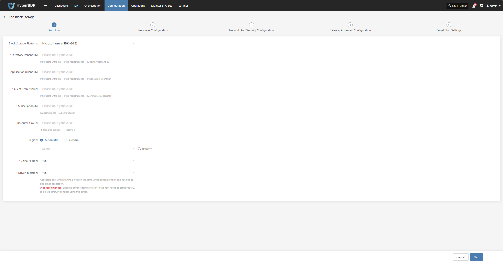
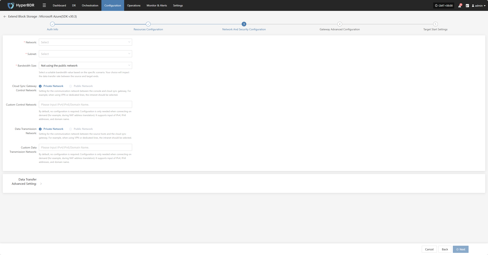
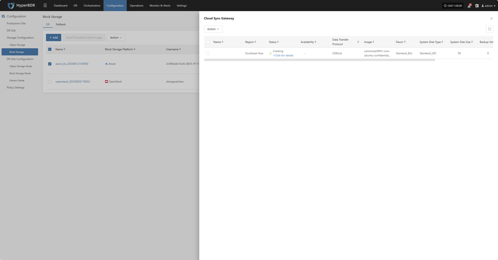
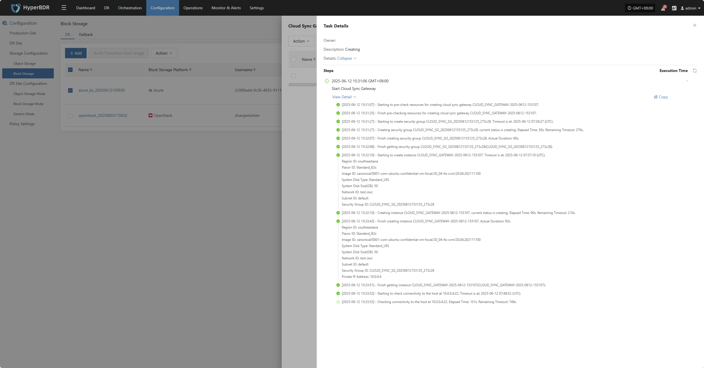

# **Microsoft Azure(SDK v30.3)**

## **Add Block Storage**

From the top navigation bar, select **"Configuration" → "Storage Configuration" → "Block Storage"** to enter the block storage page. Click the "Add" button in the upper right corner to add a new block storage configuration.

### **Auth Info**

Select "Microsoft Azure(SDK v30.3)" from the block storage platform dropdown. Fill in the following authentication information according to your actual Azure environment:

* Auth Info Description

| **Field**                 | **Example**                          | **Description**                                                                                                                                                                                                                                                         |
| ----------------------- | -------------------------------- | -------------------------------------------------------------------------------------------------------------------------------------------------------------------------------------------------------------------------------------------------------------- |
| Block Storage Platform  | Microsoft Azure(SDK v30.3)       | Select Microsoft Azure(SDK v30.3) from the dropdown list.                                                                                                                                                                                                                          |
| Directory (tenant) ID   | HPUAAG0B2•••••••••••••••         | Go to 【Microsoft Entra ID】→【App registrations】→【Directory (tenant) ID】                                                                                                                                                                                               |
| Application (client) ID | •••••••••••••••••••••••••••••••• | Go to 【Microsoft Entra ID】→【App registrations】→【Application (client) ID】                                                                                                                                                                                             |
| Client Secret Value     | Actual value                      | Go to 【Microsoft Entra ID】→【App registrations】→【Certificates & secrets】. Note: You can only view the client secret value right after creation. Please save the secret before leaving the page.                                                                                  |
| Subscription ID         | Actual value                      | Go to 【Subscriptions】→【Subscription ID】                                                                                                                                                                                                                              |
| Resource Group          | test-zwz                         | Go to 【Resource groups】→【Name】                                                                                                                                                                                                                                       |
| Region                  | Automatic / Custom               | In automatic mode, click "Refresh" to get the latest region info. Select the corresponding Azure region from the dropdown.                                                                                                                                              |
| China Region            | Yes / No                         | Mark whether this is a China Azure account.                                                                                                                                                                                                                             |
| Driver Injection        | Yes / No                         | Only applicable when starting a host on the same virtualization platform and you need to skip driver adaptation. (Not recommended) Skipping driver repair may cause the host to fail to start. Please use this option with caution. |

After filling in the authentication info, click **"Next"** to proceed to **"Resources Configuration"**.

### **Resources Configuration**

Assign compute and storage resources for the cloud sync gateway to ensure stable and efficient operation in the target environment.

* Resources Configuration Description

| **Field**               | **Example**                                  | **Description**                                                                                                                                                                                                                                                                                                                                     |
| --------------------- | ---------------------------------------- | ------------------------------------------------------------------------------------------------------------------------------------------------------------------------------------------------------------------------------------------------------------------------------------------------------------------------------------------ |
| Region                | asia-southeast1 (Asia Pacific - Singapore)   | Select the region where the cloud sync gateway will be installed.                                                                                                                                                                                                                                           |
| Image                 | Select the corresponding Linux image         | When creating a cloud sync gateway, select a Linux OS from the list. If there is no image, manually upload an Ubuntu 20.04 image. Note: To avoid irregular image names, all images are listed here. Please select the required OS image.                              |
| Flavor                | Select vCPU and memory as needed            | The cloud sync gateway is mainly for data synchronization. It is recommended to choose at least 2 vCPU and 4 GB memory, and ensure bandwidth above 1Gbps for stable and efficient data sync.                                                                         |
| System Disk Type      | Standard HDD (local redundancy)              | Actual value as needed.                                                                                                                                                                                                                                                                                      |
| System Disk Size      | User-defined (depends on instance needs)     | Choose a suitable size based on the workload. Default is 50G, recommended size is 50G.                                                                                                                                                                                |

After resource configuration, click **"Next"** to proceed to **"Network And Security Configuration"**.

### **Network And Security Configuration**

Assign network resources for the cloud sync gateway to ensure stable and efficient operation in the target environment.

* Network And Security Configuration Description

| **Field**                            | **Example**                                                  | **Description**                                                                                                                                                                                                      |
| ---------------------------------- | -------------------------------------------------------- | ----------------------------------------------------------------------------------------------------------------------------------------------------------------------------------------------------------- |
| Network                            | project-vpc (xxx.xxx.xxx.xxx/xx)                         | Select the private network for the cloud sync gateway from the dropdown. Only networks in the same region are shown. Actual value as needed.                                                                 |
| Subnet                             | project-subnet-public1-cn-north-1a (xxx.xxx.xxx.xxx/xx)  | Select the subnet in the available zone from the dropdown. Actual value as needed.                                                                                                                            |
| Bandwidth Size                     | Not using the public network1 Mbps20 Mbps50 Mbps100 Mbps | Select a suitable bandwidth based on your scenario. This affects the data transfer rate between source and target.                                                     |
| Cloud Sync Gateway Control Network | Private Network / Public Network                         | Set the communication network between the console and the cloud sync gateway. For VPN or dedicated line, select private network.                                       |
| Custom Control Network             | Enter IPv4/IPv6/domain name                              | No configuration needed by default. Configure only if needed (e.g., for NAT). Supports IPv4, IPv6, and domain names.                                                  |
| Data Transmission Network          | Private Network / Public Network                         | Set the communication network between source hosts and the cloud sync gateway. For VPN or dedicated line, select private network.                                      |
| Custom Data Transmission Network   | Enter IPv4/IPv6/domain name                              | No configuration needed by default. Configure only if needed (e.g., for NAT). Supports IPv4, IPv6, and domain names.                                                  |

* Data Transfer Advanced Setting Description

| **Field**                | **Options**                                  | **Description**                                                                                                                                                                                                                                                                                                             |
| ---------------------- | ---------------------------------------- | ------------------------------------------------------------------------------------------------------------------------------------------------------------------------------------------------------------------------------------------------------------------------------------------------------------------ |
| Data Transfer Protocol | S3Block / iSCSI (Not Recommended)        | This is the data transfer protocol between the source and the sync gateway. S3Block is widely used for WAN and is better for data transfer. iSCSI is for storage networks and suitable for stable network environments. |

After network and security configuration, click **"Next"** to proceed to **"Gateway Advanced Configuration"**.

### **Gateway Advanced Configuration**

> Due to Azure image restrictions, you must use "ubuntu" as the image username.

* Gateway Advanced Configuration Description

| **Field**     | **Example** | **Description**                                       |
| ----------- | ------- | -------------------------------------------- |
| Access Type | Password / Key | Specify the authentication method for logging in to the VM. Key is not supported yet.   |
| Username    | ubuntu  | Due to Azure image restrictions, the username must be "ubuntu".            |
| Password    | —       | If using password login, enter the password here. This will be used to log in to the VM.      |
| Port        | 22      | Default SSH port for VM login. Recommended to keep as `22`. Change only if required by security policy. |

After advanced gateway configuration, click **"Next"** to proceed to **"Target Start Settings"**.

### **Target Start Settings**

* Target Start Settings Description

| **Field**                      | **Example**                                                                                                                                            | **Description**                                                                                   |
| ---------------------------- | -------------------------------------------------------------------------------------------------------------------------------------------------- | ---------------------------------------------------------------------------------------- |
| Boot Type                    | Boot From Volume / Boot From Image                                                                                                                 | Choose how the transition host starts: For long-term business on the cloud, use **Boot From Volume**; for testing or drills, use **Boot From Image**.                         |
| Transition Host Image        | Auto Create / Select Image                                                                                                                         | If "Auto Create" is selected, the system will create the required image automatically. If "Select Image", specify an existing image from the dropdown.                                           |
| Image Access Type            | Password / Secret Key                                                                                                                              | Authentication method for accessing the image when creating the VM:   **Password**: Use username and password;   **Key**: Use key file (recommended, more secure, not supported yet). |
| Username                     | ubuntu                                                                                                                                             | Due to Azure image restrictions, the username must be "ubuntu".                                                        |
| Password                     | ••••••••••••••                                                                                                                                     | Fill in if using password access. Leave blank if using key access.                                                       |
| Port                         | 22                                                                                                                                                 | Default SSH port for VM login. Recommended to keep as `22`. Change only if required by security policy.                                             |
| Driver Adaption Network Mode | Public Network without Proxy / Private Network without Proxy / Public Network with Cloud Sync Gateway Proxy / Private Network with Cloud Sync Gateway Proxy | This option is for fixing the network connection of the host.                 |
| Driver Adaption              | Yes / No                                                                                                                                              | Use the button to enable or disable.                                                                               |

After completing the target start settings, click **"Complete"**. The system will automatically create the cloud sync gateway and transition host image.

### **View Details**

During creation, click ">Click for list" to view the detailed list of cloud sync gateways being created.

Select the corresponding host and click ">Click for details" to view detailed logs generated during the task, helping you quickly understand the execution status and troubleshoot issues.

<!-- @include: ./huawei.md{108-150} -->