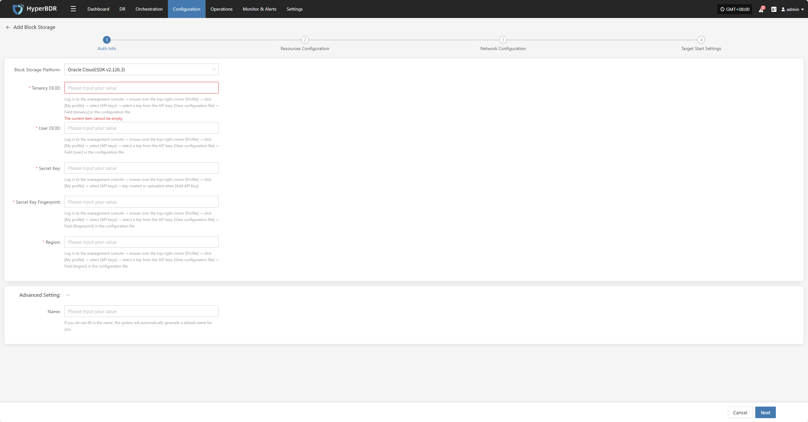
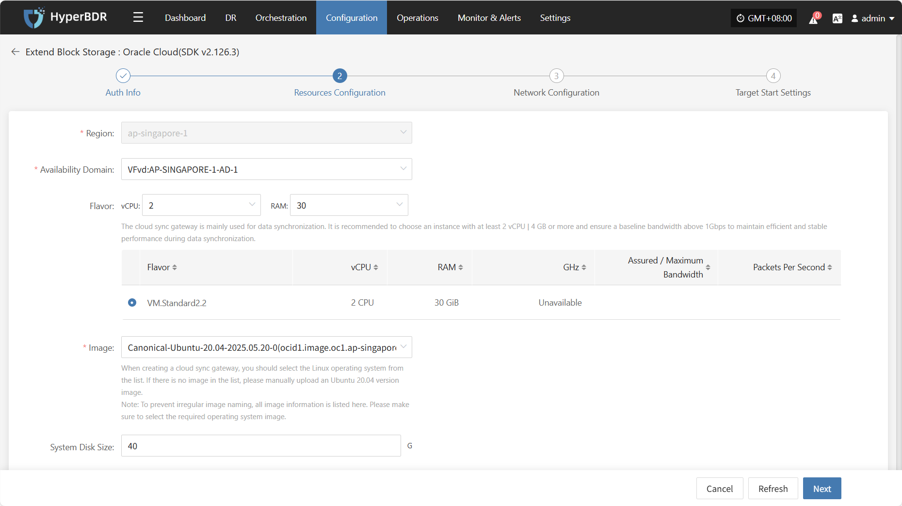
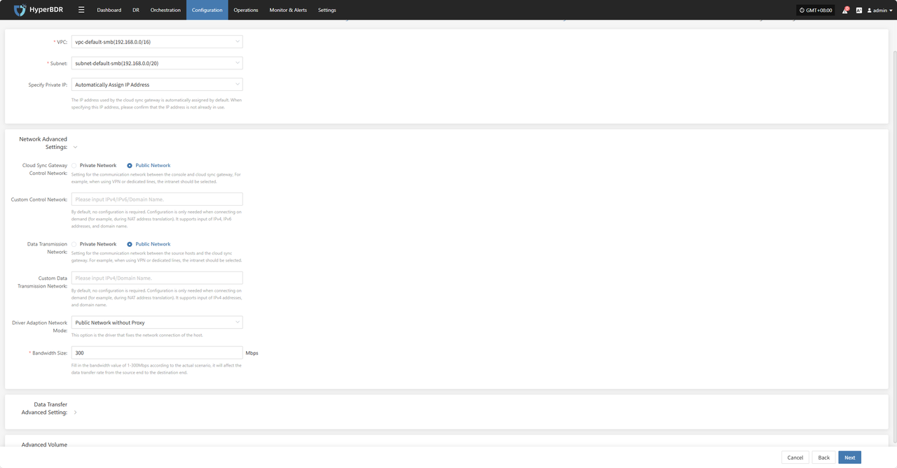
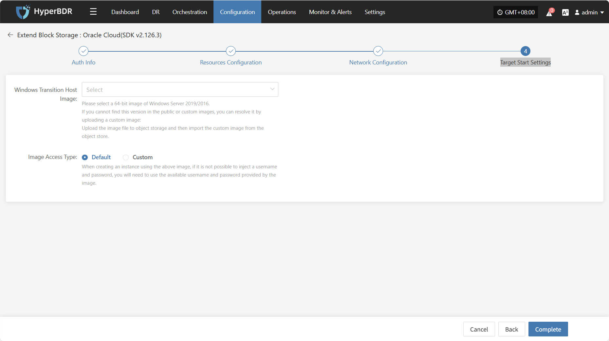
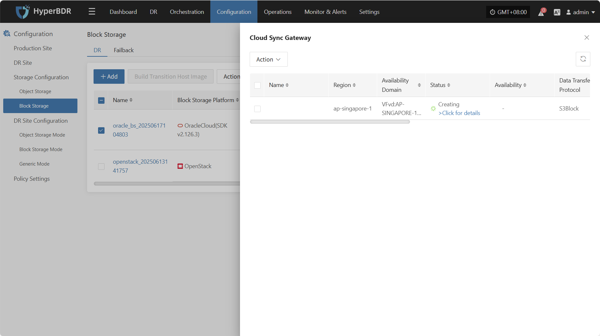
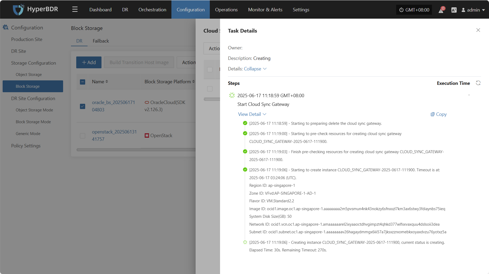

# **Oracle cloud(SDK v2.126.3)**

## Add Block Storage

From the top navigation bar, select **"Configuration Management" → "Storage Configuration" → "Block Storage"** to enter the block storage page. Click the "Add" button in the upper right corner to add a new block storage configuration.

### Auth Info

In the block storage platform, select "Oracle cloud(SDK v2.126.3)" from the dropdown list. Fill in the following authentication information according to your actual situation:

* Auth Info Description

| Parameter              | Example                                 | Description                                                                                                                                                                                                                             |
|------------------------|-----------------------------------------|-----------------------------------------------------------------------------------------------------------------------------------------------------------------------------------------------------------------------------------------|
| Tenancy OCID           | ocid1.tenancy.oc1..aaaaaaaaxxxx         | Log in to the management console → mouse over the top-right corner \[Profile] → click \[My profile] → select \[API keys] → select a key from the API keys \[View configuration file] → Field \[tenancy] in the configuration file.     |
| User OCID              | ocid1.user.oc1..aaaaaaabbbbb            | Log in to the management console → mouse over the top-right corner \[Profile] → click \[My profile] → select \[API keys] → select a key from the API keys \[View configuration file] → Field \[user] in the configuration file.        |
| Secret Key             | oci\_api\_key.pem                        | Log in to the management console → mouse over the top-right corner \[Profile] → click \[My profile] → select \[API keys] → key created or uploaded when \[Add API Key].                                                                |
| Secret Key Fingerprint | 20:3b:97:13:55:1c:8c:xx:xx:xx:xx:xx:xx   | Log in to the management console → mouse over the top-right corner \[Profile] → click \[My profile] → select \[API keys] → select a key from the API keys \[View configuration file] → Field \[fingerprint] in the configuration file. |
| Region                 | ap-singapore-1                          | Log in to the management console → mouse over the top-right corner \[Profile] → click \[My profile] → select \[API keys] → select a key from the API keys \[View configuration file] → Field \[region] in the configuration file.      |
| Advanced Setting       | If you do not fill in the name, the system will automatically generate a default name for you. | If you do not fill in the name, the system will automatically generate a default name for you.                                                                                                   |

After filling in the authentication information, click **"Next"** to proceed to **Resources Configuration**.

### Resources Configuration

Allocate compute and storage resources for the cloud sync gateway to ensure stable and efficient operation in the target environment.

* Resources Configuration Description

| Configuration Item     | Example Value                                   | Description                                                                                                                                                                                                                                                                      |
|------------------------|--------------------------------------------------|----------------------------------------------------------------------------------------------------------------------------------------------------------------------------------------------------------------------------------------------------------------------------------|
| Region                 | ap-singapore-1                                   | Please select the region where the cloud sync gateway will be deployed.                                                                                                                                                                   |
| Availability Domain    | VFVd:AP-SINGAPORE-1-AD-1                         | Select the availability domain in the selected region from the dropdown list.                                                                                                                                                             |
| Flavor                 | Select vCPU and memory as needed from the dropdown list.   After selection, the example specifications below will be refreshed automatically. | The cloud sync gateway is mainly used for data synchronization.   It is recommended to choose an instance with at least 2 vCPU \| 4 GB or more   and ensure a baseline bandwidth above 1Gbps   to maintain efficient and stable performance during data synchronization. |
| Image                  | Select the corresponding Linux image from the dropdown list. | When creating a cloud sync gateway, you should select the Linux operating system from the list.   If there is no image in the list, please manually upload an Ubuntu 20.04 version image.   **Note**: To prevent irregular image naming, all image information is listed here.   Please make sure to select the required operating system image. |
| System Disk Size       | User-defined (as required by the instance)       | Choose an appropriate size based on the workload of the sync gateway.   The default is 40G, and 50G is recommended.                                                                                                                    |

After resource configuration is complete, click **"Next"** to proceed to **Network Configuration**.

### Network Configuration

Allocate network resources for the cloud sync gateway to ensure stable and efficient operation in the target environment.

* Network Configuration Description

| **Configuration Item** | **Example Value**                                         | **Description**                                      |
| ---------------------- | -------------------------------------------------------- | ---------------------------------------------------- |
| VPC                    | project-vpc (xxx.xxx.xxx.xxx/xx)                         | Select the VPC to which the cloud sync gateway belongs from the dropdown list. |
| Subnet                 | project-subnet-public1-cn-north-1a (xxx.xxx.xxx.xxx/xx)  | Select the subnet in the selected availability domain from the dropdown list.   |

* Network Advanced Settings Description

| **Configuration Item**               | **Example Value**                                                                                                                                            | **Description**                                                                                                                                                                                                 |
| ------------------------------------ | ------------------------------------------------------------------------------------------------------------------------------------------------------------ | --------------------------------------------------------------------------------------------------------------------------------------------------------------------------------------------------------------- |
| Cloud Sync Gateway Control Network   | Private Network / Public Network                                                                                                                             | Setting for the communication network between the console and cloud sync gateway. For example, when using VPN or dedicated lines, select the private network.                                                   |
| Custom Control Network               | Please input IPv4/IPv6/Domain Name                                                                                                                           | By default, no configuration is required. Configure only when needed (e.g., NAT address translation). Supports IPv4, IPv6, and domain names.                                                                   |
| Data Transmission Network            | Private Network / Public Network                                                                                                                             | Setting for the communication network between the console and cloud sync gateway. For example, when using VPN or dedicated lines, select the private network.                                                   |
| Custom Data Transmission Network     | Please input IPv4/IPv6/Domain Name                                                                                                                           | By default, no configuration is required. Configure only when needed (e.g., NAT address translation). Supports IPv4, IPv6, and domain names.                                                                   |
| Driver Adaption Network Mode         | Public Network without Proxy / Private Network without Proxy / Public Network with Cloud Sync Gateway Proxy / Private Network with Cloud Sync Gateway Proxy   | This option is for the driver that fixes the network connection of the host.                                                                                             |

* Data Transfer Advanced Setting Description

| **Configuration Item**     | **Optional Value**                  | **Description**                                                                                                                                                                                                                  |
|----------------------------|-------------------------------------|----------------------------------------------------------------------------------------------------------------------------------------------------------------------------------------------------------------------------------|
| Data Transfer Protocol     | S3Block / iSCSI (Not Recommended)   | This option is the data transfer protocol between the source and the sync gateway.   S3Block is widely used in WAN environments and is more suitable for data transfer.   The iSCSI protocol is used for storage networks and is suitable for stable network environments. |

After network configuration is complete, click **"Next"** to proceed to **Target Start Settings**.

### Target Start Settings

Configure the key parameters required for starting the target during recovery or drill, ensuring resources can take over and run smoothly.

* Target Start Settings Description

| **Configuration Item**           | **Example Value**                      | **Description**                                                                                                                                                                                                                      |
| -------------------------------- | -------------------------------------- | ------------------------------------------------------------------------------------------------------------------------------------------------------------------------------------------------------------------------------------ |
| Windows Transition Host Image    | Windows Server-2019-XXXXXXXXXXXXX      | Please select a 64-bit image of Windows Server 2019/2016.  
If you cannot find this version in the public or custom images, you can resolve it by uploading a custom image:  
Upload the image file to object storage and then import the custom image from the object store. |
| Image Access Type                | Default / Custom                       | When creating an instance using the above image, if it is not possible to inject a username and password, you will need to use the available username and password provided by the image.                                             |

After completing the target start settings, click **"Finish"**. The system will automatically create the cloud sync gateway and transition host image.

### View Details

During the creation process, click ">Click for list" to view the detailed list of created cloud sync gateways.

Select the corresponding host and click "Click for details" to view detailed logs generated during the task creation process, which helps you quickly understand the execution status and troubleshoot issues.

<!-- @include: ./huawei.md#snippet -->