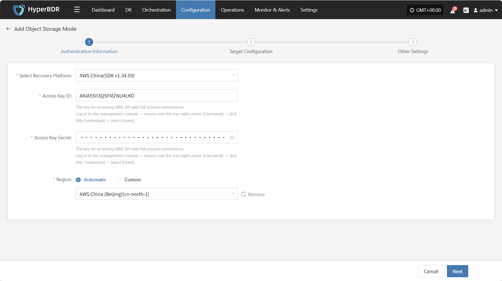
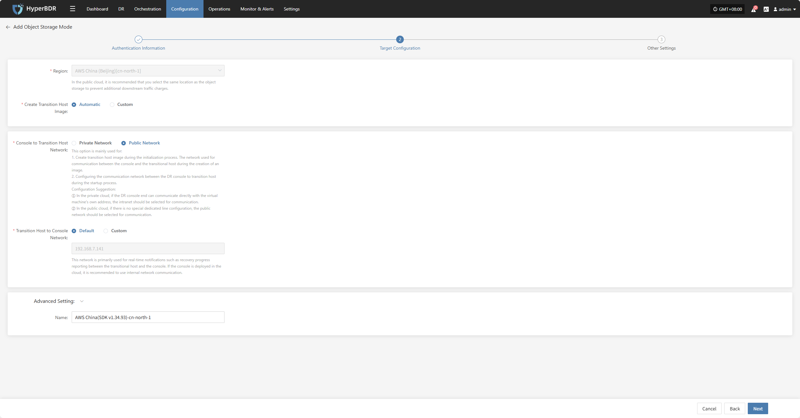
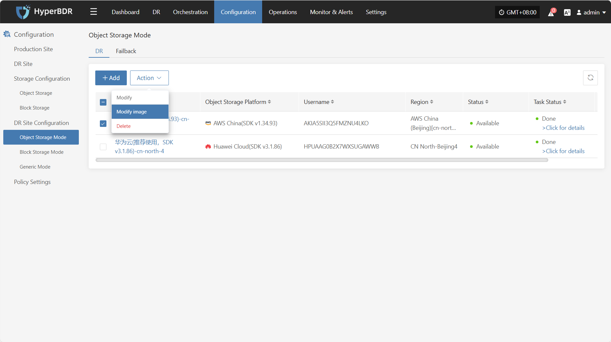
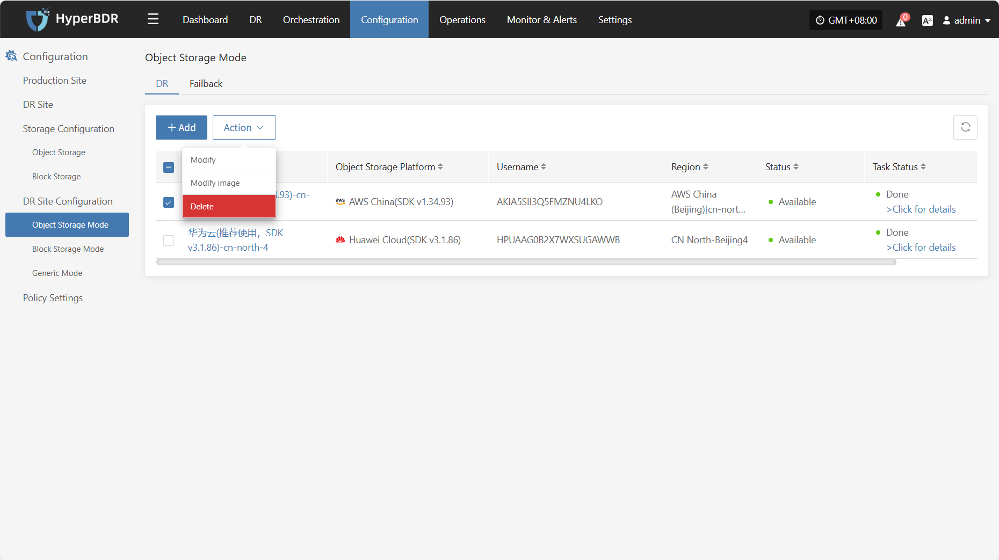
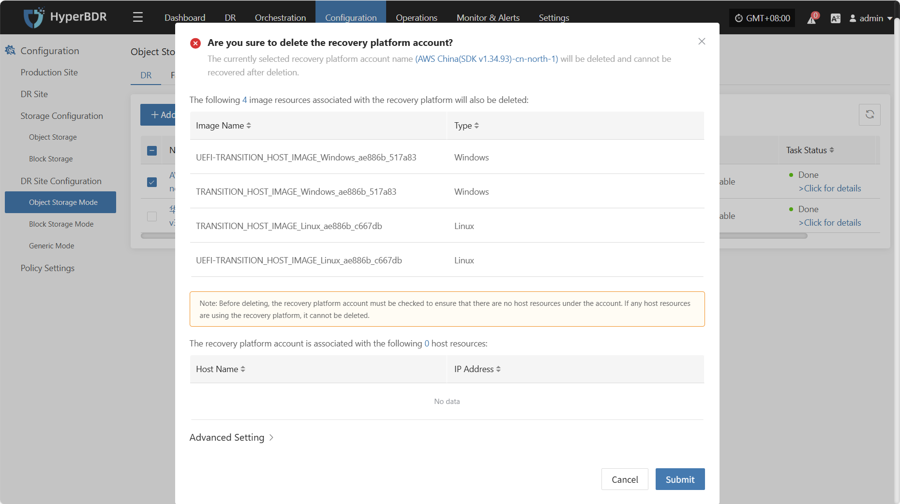

# **AWS China (SDK v1.34.93)**

## **Add Object Storage**

From the top navigation bar, select **"Configuration" → "DR Site Configuration" → "Object Storage Mode"** to enter the object storage page. Click the "Add" button to configure a new object storage.

### **Authentication Information**

In the recovery platform dropdown, select "AWS China (SDK v1.34.93)". Fill in the following authentication information according to your actual access situation:

* Authentication Information Description

| **Item**                | **Example**                           | **Description**                                                                                                                                                                               |
|-------------------------|---------------------------------------|-----------------------------------------------------------------------------------------------------------------------------------------------------------------------------------------------|
| Select Recovery Platform| AWS China (SDK v1.34.93)              | Select AWS China (SDK v1.34.93) from the dropdown list.                                                                                                |
| Access Key ID           | AKIA5SII3Q•••••••••••••••             | The key ID for accessing AWS API with full account permissions. How to get: Log in to the AWS console → hover over the top-right [Username] → click [My Credentials] → select [Users].      |
| Access Key Secret       | ••••••••••••••••••••••••••••••••      | The secret key for accessing AWS API with full account permissions. How to get: same as above. It is recommended to hide the value when entering.                                          |
| Region                  | Automatic / Custom                     | If set to automatic, click "Retrieve" to get the latest region information. You can also select the AWS region manually from the dropdown list.                                               |

After filling in the authentication information, click **"Next"** to proceed to **"Target Configuration"**.

### **Target Configuration**

* **Target Configuration Description**

| **Item**                        | **Example**                             | **Description**                                                                                                                                                                                                                                                           |
|----------------------------------|-----------------------------------------|---------------------------------------------------------------------------------------------------------------------------------------------------------------------------------------------------------------------------------------------------------------------------|
| Region                           | AWS China (Beijing)[cn-north-1]         | Selected based on authentication information and cannot be changed. For public cloud, it is recommended to select the same region as the object storage to avoid extra traffic charges.                                          |
| Create Transition Host Image     | Automatic / Custom                      | If set to automatic, the system will create the transition host image as required. If set to custom, you need to select zone, system type, and other settings. See the custom creation instructions below.                         |
| Console to Transition Host Network | Private Network / Public Network       | Used for communication between the console and the transition host. Private cloud: select private network if direct communication is possible. Public cloud: select public network if there is no dedicated line.             |
| Transition Host to Console Network | Default / Custom                       | Mainly used for real-time notifications such as recovery progress between the transition host and the console. If the console is deployed in the cloud, it is recommended to use the internal network.                         |
| Advanced Setting                 | Name: AWS China (SDK v1.34.93)-cn-north-1 | If you do not enter an ID, the system will generate one automatically.                                                                                                                      |

* **Custom Transition Host Creation Instructions**

| **Item**                        | **Example**                                          | **Description**                                                                                          |
|----------------------------------|-----------------------------------------------------|----------------------------------------------------------------------------------------------------------|
| Zone                             | cn-north-la                                         | Select the zone where your business is deployed (choose according to your needs).                        |
| Flavor                           | 2/4GB/c6i.large                                     | Select the instance type based on your workload (CPU / Memory / Model).                                  |
| Network                          | Project-vpc (10.0.0.0/16)                           | Select the planned VPC network.                                                                          |
| Subnet                           | Project-subnet-public1-cn-north-1a (10.0.0.0/20)    | Select the subnet under the corresponding zone.                                                          |
| Linux Transition Host Base Image  | ubuntu-focal-20.04-amd64-server-20250530            | Temporary image for data recovery and driver adaptation. Recommended: Ubuntu 20.04 / 24.04. **Note:** If the source kernel ≥ 6.x, use 24.04. |
| Windows Transition Host Base Image| Windows Server-2019-English-Full-Base-2025.05.15    | Temporary image for data recovery and driver adaptation. Recommended: Windows Server 2016 / 2019 64bit.|
| System Disk Type                  | General Purpose SSD (gp3)                           | Select the disk type according to performance requirements.                                               |

### **Other Settings**

* **Other Settings Description**

| **Item**                                   | **Example**                                       | **Description**                                                                                                                                                                                                                                                                                                                                                                  |
|---------------------------------------------|---------------------------------------------------|-----------------------------------------------------------------------------------------------------------------------------------------------------------------------------------------------------------------------------------------------------------------------------------------------------------------------------------------------------------------------------------|
| Windows Transition Host Image (UEFI to BIOS)| Windows Server-2019-English-Full-Base-2025.05.15  | Please select a 64-bit Windows Server 2019/2016 image.  **Main Functions:** 1. Convert Windows UEFI boot mode to BIOS boot mode. 2. Adapt drivers during the boot process. 3. Create disk types that meet cloud platform requirements.  **How to get the image:** 1. Upload to Private Image Repository: Upload the image file to object storage, then import it. 2. Obtain a Shared Image: Request a shared image from another account in the same region. |

After completing the other settings, click **"Finish"**. The system will automatically create the transition host image.

### **View Details**

During the creation process, click "Click for details" to view detailed logs, which helps you quickly understand the execution status and troubleshoot issues.

## **Action**

### **Modify**

Click "Modify" to edit authentication information, target configuration, and other settings.

### **Modify Image**

Click "Modify Image" to rebuild the transition host image.

> Note: If a transition host image already exists, rebuilding will delete the old image and create a new one.

If you select automatic creation, the system will use the default settings. For custom creation, you need to select zone, system type, and other settings. See the custom creation instructions above.

### **Delete**

