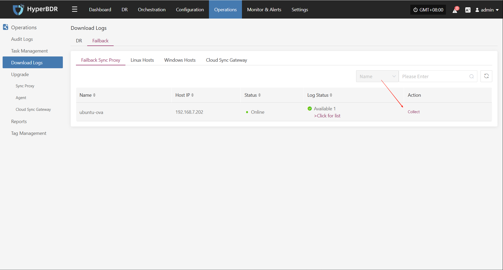
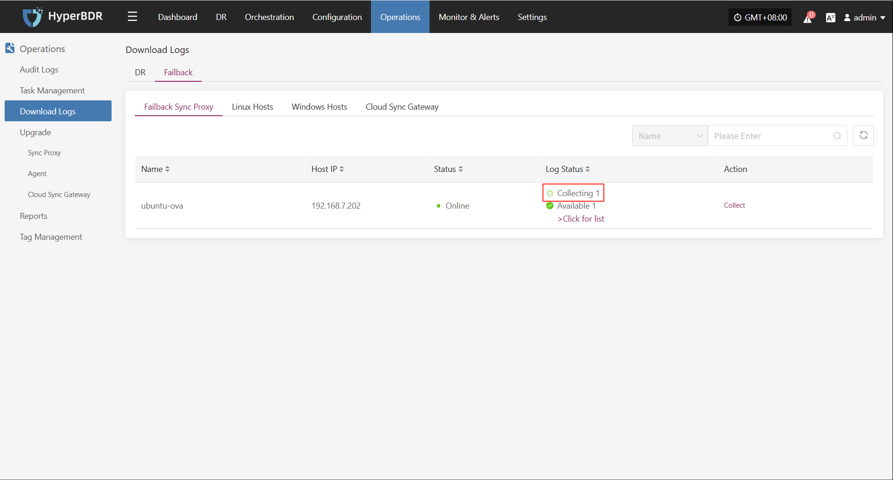
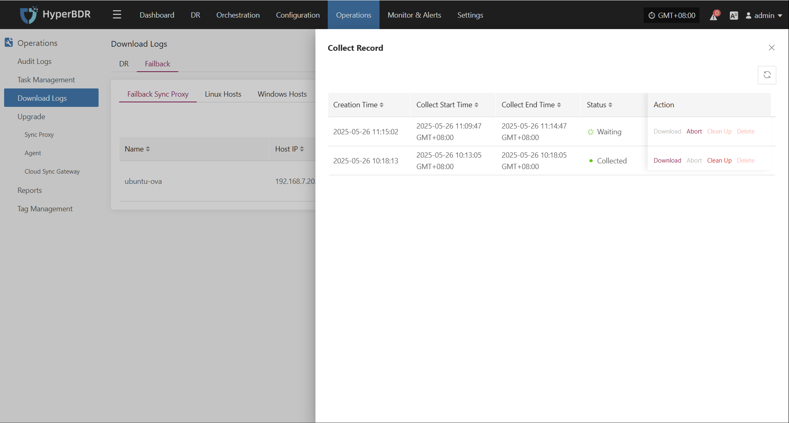

# **Download Logs**

In HyperBDR, users can go to "O&M Management > Download Logs" to quickly collect logs from key components for troubleshooting.

## **DR**

### **Supported Resource Types**

| Resource Type     | Description                                      |
|-------------------|-------------------------------------------------|
| Console           | Management node logs, including core platform services |
| Sync Proxy        | Agentless hosts deployed via OVA template        |
| Linux Host        | Logs from Linux hosts with Agent installed       |
| Windows Host      | Logs from Windows hosts with Agent installed     |
| Cloud Sync Gateway| Gateway hosts automatically created at DR start  |

### **Page Field Descriptions**

| Field Name | Example         | Description                                         |
|------------|----------------|-----------------------------------------------------|
| Host Name  | onepro         | Name of the host, used to identify the device       |
| Host IP    | 192.168.7.141  | IP address of the host                              |
| Status     | Online         | Current status (offline hosts cannot collect logs)  |
| Log Status | Downloadable    | Status of host logs (click to view details)         |
| Action     | Collect        | Collect logs                                        |

### **Collection Example: Console**

On the **"Download Logs > DR > Console"** page, users can collect and download required log files as needed for troubleshooting and monitoring.

#### **Log Collection**

Select the target host and click the "Collect" button in the corresponding row.

#### **Select Time Range**

In the pop-up dialog, set the time range for the logs you want to collect. After confirming, the system will automatically start collecting logs.

#### **Start Collection**

After confirming the time range, the system will automatically start collecting logs, and the log status will change to "Collecting".

#### **Download Logs**

After log collection is complete, the status will update to **"Downloadable"**. Users can click "View List" to see the log files and select files to download.

## **Failback**

### **Supported Resource Types**

| Resource Type         | Description                                      |
|-----------------------|-------------------------------------------------|
| Failback Sync Proxy   | Agentless hosts deployed via OVA template        |
| Linux Host            | Logs from Linux hosts with Agent installed       |
| Windows Host          | Logs from Windows hosts with Agent installed     |
| Cloud Sync Gateway    | Gateway hosts automatically created at failback  |

### **Page Field Descriptions**

| Field Name | Example         | Description                                         |
|------------|----------------|-----------------------------------------------------|
| Host Name  | ubuntu-ova     | Name of the host, used to identify the device       |
| Host IP    | 192.168.7.202  | IP address of the host                              |
| Status     | Online         | (Offline hosts cannot collect logs)                 |
| Log Status | Downloadable    | Status of host logs (click to view details)         |
| Action     | Collect        | Collect logs                                        |

### **Collection Example: Failback Sync Proxy**

On the **"Download Logs > Failback > Failback Sync Proxy"** page, users can collect and download required log files as needed for troubleshooting and monitoring.

#### **Log Collection**

Select the target host and click the "Collect" button in the corresponding row.

#### **Select Time Range**

In the pop-up dialog, set the time range for the logs you want to collect. After confirming, the system will automatically start collecting logs.

#### **Start Collection**

After confirming the time range, the system will automatically start collecting logs, and the log status will change to "Collecting".

#### **Download Logs**

After log collection is complete, the status will update to **"Downloadable"**. Users can click "View List" to see the log files and select files to download.

