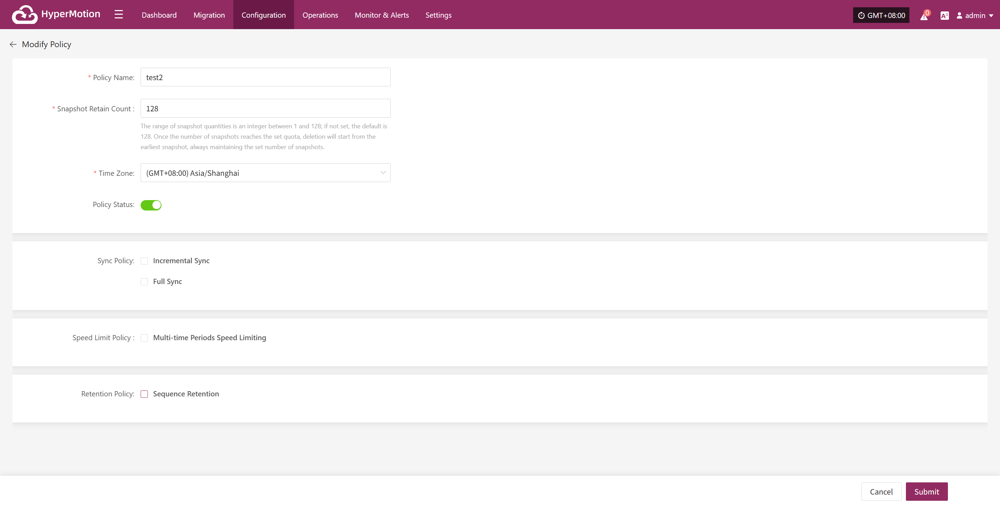
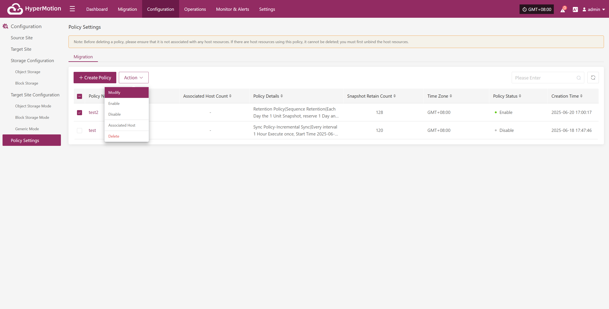
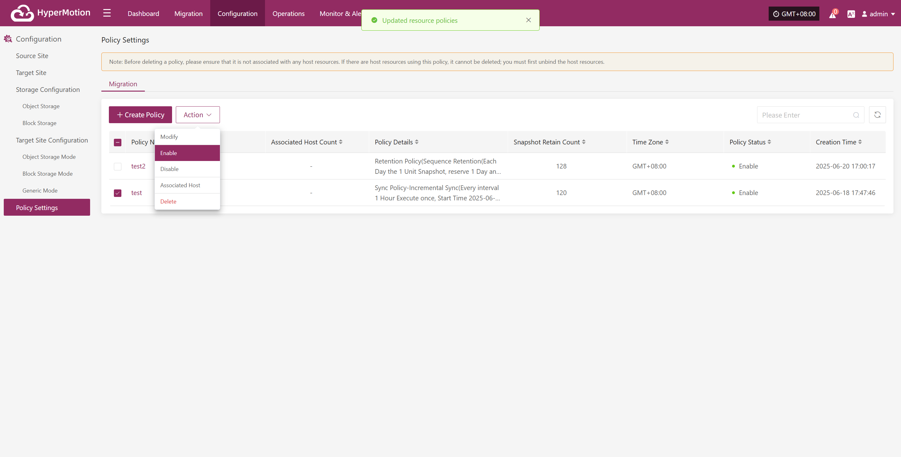
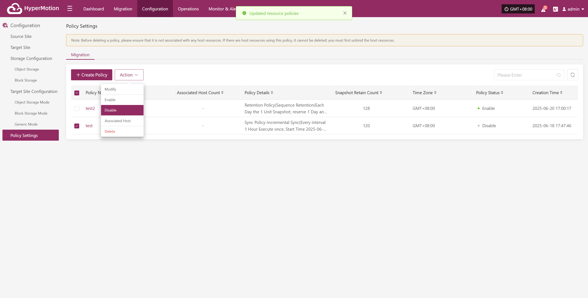
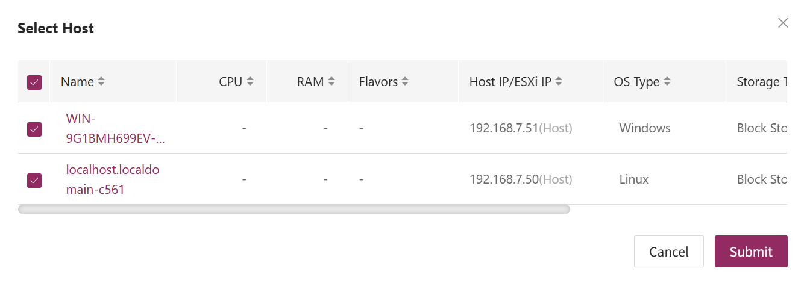
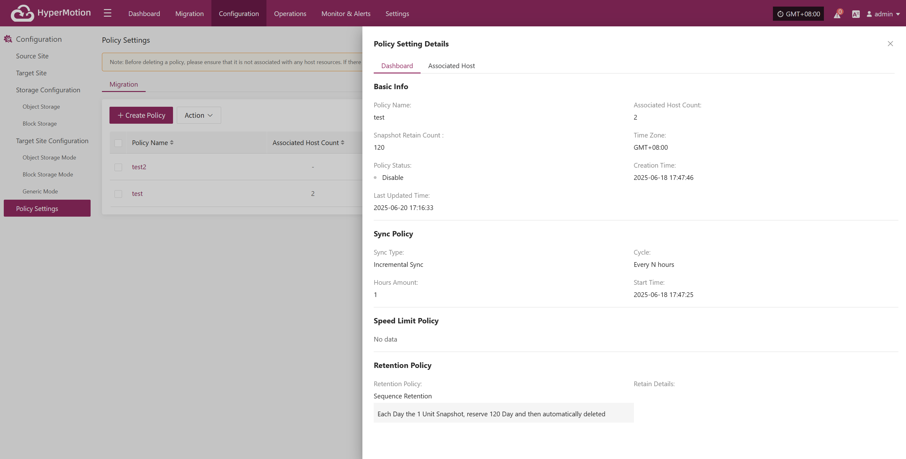
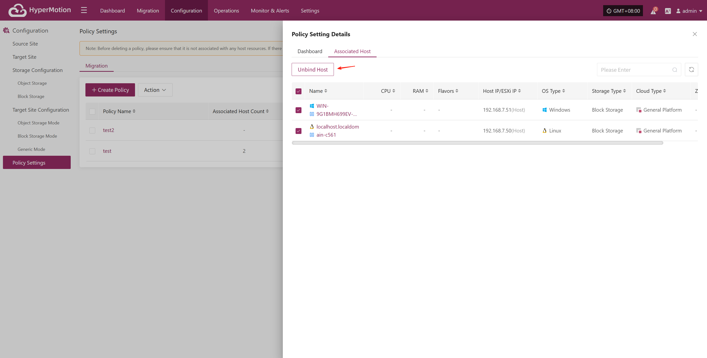

# **Policy Settings**

The policy settings module is used to centrally configure and manage key control policies for Migration processes, helping users flexibly define data sync, resource scheduling, and retention strategies. There are three types of policies: **Sync Policy** (defines sync frequency and method), **Speed Limit Policy** (controls network or IO usage during sync), and **Retention Policy** (sets snapshot or replica retention period and count to optimize storage and ensure recovery needs).

## **Create Policy**

Go to [Configuration] > [Policy Settings].

Click [Create Policy] to add a new policy label and fill in the required configuration as needed. The system supports multiple policy types at the same time, so you can flexibly manage Sync, Speed Limit, and Retention policies for comprehensive Migration control.

After entering the policy name, setting the snapshot retention count, and selecting the policy status, you can configure the following details.

### **Sync Policy**

You can set up sync policies by choosing a time period or using advanced settings for different types.

> Incremental and full sync can be configured in parallel. To ensure tasks run smoothly, avoid overlapping times.

#### **Incremental Sync**

Enable incremental sync in the policy. After the initial full sync, the system will run incremental sync tasks at the set frequency or trigger, providing ongoing, lightweight data protection.

##### **Time Period Settings**

| **Field** | **Example**                   | **Description**                             |
|-----------|------------------------------|---------------------------------------------|
| Type      | Time Period                   | Type of sync schedule                       |
| Cycle     | Every N minutes               | Runs at a fixed interval                    |
| Minutes   | 30                            | Runs every N minutes, N = 5–59              |
| Start Time| 2025-05-27 00:00:00           | First run time, then triggers by cycle      |
| Time Zone | (GMT+08:00) Asia/shanghai     | Time zone for scheduling, set explicitly    |

##### **Advanced Setting**

| **Field**        | **Example**         | **Description**                                                                                                                                                                                                                                   |
|------------------|--------------------|--------------------------------------------------------------------------------------------------------------------------------------------------------------------------------------------------------------------------------------------------|
| Type             | Advanced           | Use crontab expressions for flexible scheduling.                                                                                                                                                           |
| Configuration    | */30 * * * *       | Use crontab to set rules with minute, hour, day, month, week. Symbols:   `*` every, `,` multiple, `-` range, `/` step.   Examples:   `15 * * * *` 15th min each hour   `0 2 * * *` 2am daily   `0 0 * * 1` Mon midnight   `0 5 1 * *` 5am 1st monthly   `*/5 * * * *` every 5 min   `*/5 8-20 * * *` every 5 min 8am-8pm |
| Start Time       | 2025-05-27 00:00:00| First run time                                                                                                               |
| Time Zone        | (GMT+08:00) Asia/shanghai | Time zone for scheduling, set explicitly    |

#### **Full Sync**

The system will run a full sync first, so the target has a complete copy of the source. This uses more resources and bandwidth and may take longer, so schedule carefully to avoid business impact.

##### **Time Period Settings**

| **Field** | **Example**                   | **Description**                             |
|-----------|------------------------------|---------------------------------------------|
| Type      | Time Period                   | Type of sync schedule                       |
| Cycle     | Every N minutes               | Runs at a fixed interval                    |
| Minutes   | 30                            | Runs every N minutes, N = 5–59              |
| Start Time| 2025-05-27 00:00:00           | First run time, then triggers by cycle      |
| Time Zone | (GMT+08:00) Asia/shanghai     | Time zone for scheduling, set explicitly    |

##### **Advanced Setting**

| **Field**        | **Example**         | **Description**                                                                                                                                                                                                                                   |
|------------------|--------------------|--------------------------------------------------------------------------------------------------------------------------------------------------------------------------------------------------------------------------------------------------|
| Type             | Advanced           | Use crontab expressions for flexible scheduling.                                                                                                                                                           |
| Configuration    | */30 * * * *       | Use crontab to set rules with minute, hour, day, month, week. Symbols:   `*` every, `,` multiple, `-` range, `/` step.   Examples:   `15 * * * *` 15th min each hour   `0 2 * * *` 2am daily   `0 0 * * 1` Mon midnight   `0 5 1 * *` 5am 1st monthly   `*/5 * * * *` every 5 min   `*/5 8-20 * * *` every 5 min 8am-8pm |
| Start Time       | 2025-05-27 00:00:00| First run time                                                                                                               |
| Time Zone        | (GMT+08:00) Asia/shanghai | Time zone for scheduling, set explicitly    |

### **Speed Limit Policy**

You can define multiple time periods, each with its own speed limit, to manage bandwidth during peak and off-peak hours.

> You can set different speed limits for different periods in the same cycle. Changing the cycle will clear current speed limit settings.

#### **Multi-time Periods Speed Limiting**

Set different bandwidth limits for different time periods to flexibly control sync network usage.

#### **Multi-time Periods Speed Limiting Settings**

| **Field** | **Example**                                         | **Description**                                     |
|-----------|-----------------------------------------------------|-----------------------------------------------------|
| Cycle     | Every N days / week / month                         | Cycle type: daily interval, specific days of week/month |
| Days      | 1                                                   | For "every N days", N = 1-30                        |
| Date      | Monday, Wednesday                                   | For "every week", select days                        |
| Date      | 5th                                                 | For "every month", select dates                      |
| Limit Time| 00:00 - 23:59                                       | Time period for speed limit                          |
| Time Zone | (GMT+08:00) Asia/Shanghai                           | Time zone for limit period                           |
| Host Limit| 10 Mbps                                             | Max bandwidth per host during sync                   |
| Speed Limit Details | e.g. "1,2,3,4,5,6,7,8,15,22,29 00:00-23:59 100Mbps" | Shows after adding parameters                        |

### **Retention Policy**

Retention policy defines how backup or sync data is kept, helping manage storage and avoid waste.

> Make sure you have enough quota for new snapshots, or sync will fail.

#### **Sequence Retention**

The system keeps the latest copies by time. When the number exceeds the set limit, old data is deleted automatically.

#### **Sequence Retention Settings**

You can set how many copies to keep for different time periods using four dropdowns. The system will keep the set number and delete older data.

> Note: Minimum is 1, maximum is 129.

## **Action**

Select a policy and click [Actions] to configure or edit.

### **Modify**

Select a policy, click [Actions] > [Modify] to edit the name, snapshot count, or other settings.

### **Enable**

Select a policy, click [Actions] > [Enable] to change its status.

### **Disable**

Select a policy, click [Actions] > [Disable] to change its status.

### **Associated Host**

Select a policy, click [Actions] > [Associated Host] to link hosts to this policy.

### **Delete**

Select a policy, click [Actions] > [Delete] to remove it.

> Note: Before deleting, make sure the policy is not linked to any hosts. If it is, unbind the hosts first.

## **Policy Setting Details**

Click a policy name to view its detailed configuration.

### **Dashboard**

On the policy details page, you can view all configuration items, including sync, speed limit, and retention policies.

### **Associated Host**

On the associated host page, you can view all hosts linked to this policy, including host name, IP, and other details.

### **Unbind Host**

Select the host you want to unbind, click [Unbind Host], and confirm to complete.

