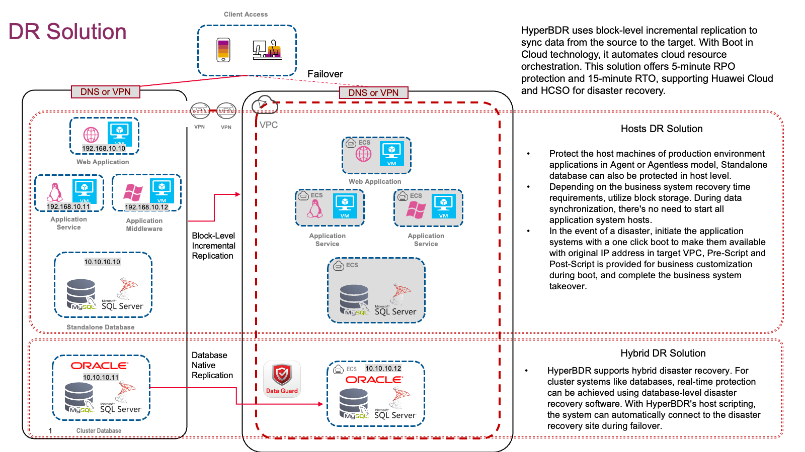

# RPO & RTO 最佳实践

## 如何规划合理的RPO和RTO时间

在合理规划业务系统的恢复时间目标（RTO）和恢复点目标（RPO）时，需要综合考虑多种因素，服务水平协议（SLA）和外部合规要求，而不同的容灾方式又对容灾成本产生了直接影响。那么如何选择性价比方案最高的容灾方案呢？通常可以根据不同的业务连续性要求进行规划：

| 级别     | 应用类型 | RTO       | RPO    | 说明                           |
| ------ | ---- | --------- | ------ | ---------------------------- |
| Tier-0 | 核心应用 | 接近零       | 接近零    | 对业务至关重要，几乎无容忍停机和数据丢失         |
| Tier-1 | 关键应用 | 15分钟      | 接近零    | 对企业运营至关重要，需快速恢复和最小数据丢失       |
| Tier-2 | 重要应用 | 通常为4小时    | 通常为2小时 | 对业务运营影响显著，需要合理设定恢复时间和数据丢失容忍度 |
| Tier-3 | 其他应用 | 通常为8-24小时 | 通常为4小时 | 对业务影响较小，允许更长的恢复时间和数据丢失       |


针对Tier-0级别的核心应用，单纯依靠外部工具往往无法满足其高可用性需求，因此通常需要在应用级别实现高可靠性，以确保系统在任何情况下都能持续运行。这种高可靠性架构广泛应用于金融服务、电子商务、在线游戏和云计算等互联网领域，以保障业务连续性和用户体验的稳定性。实现这种架构通常包括采用冗余的硬件和网络配置、负载均衡、实时数据备份以及故障转移机制，从而构建一个完全零中断的高可靠服务体系。支持Tier-0级别核心应用的高可靠性架构会显著增加资源和人力成本，可能达到原有生产系统的2到5倍，甚至更多，因此，如果企业具备足够的财力和人力，首选这种方式来实现自身的容灾解决方案是非常合理的选择。

针对Tier-1级别的关键应用，对业务连续性要求很高，因此通常应采用混合方式构建灾备系统，以实现灾备成本和预算投入之间的平衡。这种混合方式在不改变现有软件架构的基础上，从基础架构层实现容灾，使得企业能够在确保数据安全和系统可用性的同时，控制整体容灾成本。例如：在一个典型的三层架构中，有状态的数据往往存储于数据库中，那么在容灾解决方案设计中，可以采用数据库级别的原生复制方案，像Oracle Data Guard实现数据库数据零丢失，通过HyperBDR对主机进行保护实现云中一键式恢复。在满足SLA的前提下，有效的控制了灾备资源的投入。因此，这种方案也是关键应用实现容灾的首选方案。



针对Tier-2的重要应用，由于对RPO和RTO时间具有一定的容忍度，因此更推荐完全使用灾备软件构建容灾体系。通过采用成熟的灾备软件，如HyperBDR对所有主机进行保护，企业能够实现自动化的备份与恢复，简化运维流程。HyperBDR采用了云原生的方式实现灾备软件，合理运用云资源特性，相较于传统灾备软件在云上的实现，降低了80%的云资源成本。同时，它具备快速恢复的能力，能够完全满足用户对业务恢复时间的要求。企业可以设置定期的增量备份，以减小数据丢失的风险并降低存储成本。尽管Tier-2级别应用对恢复时间和恢复点的要求相对宽松，但仍需确保在灾难发生时能够迅速恢复关键业务功能。采用HyperBDR不仅可以有效降低实施成本，还能满足企业在灵活性与可扩展性方面的需求，使其能够随着业务的发展进行调整和优化。通过这种方式，企业可以在保持成本效益的同时，确保重要应用的可用性和业务连续性。

针对Tier-3的其他应用，RPO和RTO要求更加宽松，而对于灾备投入则更加敏感。因此，最理想的方案是通过一套统一的体系，同时满足备份和容灾的双重需求。在这种情况下，HyperBDR支持云原生对象存储的能力，能够有效平衡需求与成本之间的差距。通过利用云原生对象存储，企业可以实现高效的数据备份和恢复，减少对物理存储资源的依赖。这不仅降低了存储成本，还提高了数据的可访问性和安全性。HyperBDR的灵活性允许企业根据实际需要进行调整，确保在不同业务场景中满足备份和容灾的要求。此外，HyperBDR的统一管理界面使运维人员能够轻松监控和管理备份与容灾流程，降低了操作复杂性。这种集成方案非常适合Tier-3级别应用，因为它在保持成本效益的同时，提供必要的可靠性和灵活性，从而帮助企业有效应对潜在的数据丢失风险。

## 基本概念

### RPO 和 RTO 简介

在灾难恢复方面，RPO（恢复点目标）和RTO（恢复时间目标）是两个关键概念。它们是灾难恢复规划中的关键性能指标，用于衡量系统在发生灾难性事件时的可恢复性和业务连续性。

#### 恢复点目标（RPO）

RPO 指的是系统在发生故障或灾难性事件时可以容忍数据丢失的时间范围。换句话说，RPO 定义了业务可以容忍的最大数据丢失量。通常以时间单位（如小时或分钟）来衡量，RPO 的选择取决于业务的实时数据要求和对数据丢失风险的可接受程度。较低的 RPO 值表示系统可以更频繁地备份数据，从而减少灾难性事件发生时的数据丢失量。

计算 RPO 所涉及的因素包括：

- 业务重要性：对业务运营至关重要的系统将具有较高的 RPO，而较不重要的系统将具有较低的 RPO。

- 数据变更率：数据变更率高的系统通常具有较高的 RPO，而数据变更率低的系统具有较低的 RPO。

- 备份频率：较高的备份频率导致较低的 RPO。

- 恢复时间：较短的恢复时间要求会导致较低的 RPO。

- 备份存储：如果备份存储更可靠且恢复时间更短，则 RPO 会保持较低水平。

- 合规性和监管要求：某些行业对数据恢复和保留有特定要求，这可能会影响 RPO。

- IT 预算和资源：组织的 IT 预算和可用资源可能会影响 RPO。

在计算 RPO 时，考虑上述因素是建立健壮的灾难恢复计划至关重要。

#### 恢复时间目标（RTO）

RTO（恢复时间目标）指的是系统在发生灾难性事件后恢复到正常运行所需的最长时间。它是一个时间窗口，定义了业务可以接受的最大停机时间。选择 RTO 通常基于业务的连续性要求，表明业务可以在灾难性事件后多快恢复到正常运行。较短的 RTO 表示业务连续性水平较高，因为系统可以更快地从灾难中恢复，最小化业务中断。

RTO 时间等于主机恢复时间和业务恢复时间的总和。

主机恢复时间：指在故障或灾难性事件发生后恢复系统所需的时间。这可能涉及重新启动主机、加载操作系统和应用程序等步骤。

业务恢复时间：指在主机恢复后，业务完全恢复到正常运行所需的时间。这包括确保应用程序和服务完全可用，并且业务功能正常执行。

#### 与 RPO 和 RTO 相关的灾难恢复成本：

追求较低的 RPO 通常需要更频繁的数据备份和复制，导致存储、带宽和运营成本增加。实时或接近实时的备份需要更多的资源投入，从而增加成本，同时实现较低的 RPO。相反，较高的 RPO 意味着较长的备份间隔，减少备份和复制的频率，从而降低硬件和网络成本。

实现较短的 RTO 通常需要更多的资源投入，包括高可用性系统、冗余设备和复杂的架构，这增加了硬件、软件和维护成本。相反，选择较长的 RTO 允许更多的停机时间，减少对高可用性系统的依赖，从而降低相关成本。

#### 如何选择合理的 RPO 和 RTO？

建议根据业务需求和成本容忍度采用灵活的灾难恢复计划。根据业务系统的重要性灵活选择 RPO 和 RTO。为关键业务系统提供更高的投资，以最小化潜在的数据丢失和停机时间，而辅助系统则可以接受一些牺牲以实现成本降低。对于关键业务系统，追求低的 RPO 和短的 RTO 可能需要更高的投资，而辅助系统可以容忍更高的 RPO 和较长的 RTO 以降低成本。

## HyperBDR RPO和RTO最佳实践

### HyperBDR RPO和RTO

| 存储类型 | 云平台 | 最低RPO | 最低RTO | 备注 |
| --- | --- | --- | --- | --- |
| 块存储 | 华为云 | 5分钟 | 5分钟 - 10分钟 | 在华为云中，块存储的恢复时间与数据量无关，恢复时间范围为5-10分钟。 |
| 对象存储 | 华为云 | 5分钟 | 5分钟到几小时（取决于实际恢复数据量） | 在华为云中，对象存储的恢复时间目标（RTO）受多种因素影响，包括数据量和恢复主机的规格。有关详细的计算方法，请参阅RTO规划的最佳实践。 |

### RPO计算的最佳实践

#### RPO计算

在HyperBDR中，影响RPO的主要因素主要包括网络（带宽和延迟）和数据变化量，其中RPO大约等于数据变化量除以网络。

HyperBDR主要使用块级差异捕获技术来获取数据变化量。这涉及在操作系统的块级别上捕获单位时间范围内已更改的块的总和，可以根据具体的业务场景进行估计。

网络带宽和延迟指的是用户当前环境与云之间的连接。根据使用的模式，它们分为以下几类：


- 块存储：用户端和云端同步网关之间的公共网络的网络带宽和延迟。

- 对象存储：用户端和云端对象存储之间的网络带宽和延迟。


假设用户的生产数据分配容量为1TB，我们概述了在不同RPO要求下的带宽和数据变化量。


| 数据量（TB）  | RPO期望（分钟）  | 数据变化率（%） | 数据变化量（GB） | 估计带宽（Mbps） |
| --- | --- | --- | --- | --- |
| 1 | 5 | 5.00% | 51.20  | 1398  |
| 1 | 10 | 5.00% | 51.20  | 699  |
| 1 | 30 | 5.00% | 51.20  | 233  |
| 1 | 60 | 5.00% | 51.20  | 117  |
| 1 | 240 | 5.00% | 51.20  | 29  |
| 1 | 720 | 5.00% | 51.20  | 10  |
| 1 | 1440 | 5.00% | 51.20  | 5  |

### RTO计算的最佳实践

#### 块存储

在华为云中，块存储的恢复时间与数据量和用于恢复的主机规格无关。RTO时间范围为5分钟到10分钟。以下是1TB容量的模拟测试场景供参考：

| 磁盘数量 | 恢复主机规格 | 磁盘类型 | 恢复主机持续时间（分钟） |
| --- | --- | --- | --- |
| 单磁盘（使用容量800GB）<br/>多磁盘（使用容量1010GB） | 无限制（确保所选主机规格可以使用相应的磁盘类型） | 高I/O（SAS） <br/> 通用型SSD（GPSSD） <br/> 超高I/O（SSD） <br/> 极速SSD（ESSD） | 5 - 10 |

#### 对象存储

在华为云中，对象存储模式受多个因素影响，主要包括：

- 数据量：正在恢复的实际数据量。

- 磁盘数量：同时从多个磁盘恢复时，恢复时间大约等于最大磁盘恢复所需的时间。

- 临时恢复网关规格配置

   - 在HyperBDR中进行恢复时，会启动一个主机作为临时恢复网关进行业务恢复。此主机的规格由用户在灾难恢复配置中设置。这些规格中的CPU、内存、最大带宽和最大数据包发送/接收能力等指标可能会影响恢复速度。

   - 规格对磁盘并发恢复速度的影响：在HyperBDR的恢复过程中，需要CPU和内存资源来解密和解压（如果已启用）对象存储数据，然后将其恢复到块存储中。默认情况下，数据恢复是并发进行的，每个磁盘恢复需要至少1GB的内存。例如，使用2核和4GB内存的规格，最多可以同时恢复4个磁盘。

- 卷类型：在HyperBDR的恢复过程中，对象存储中的数据将重新复制到块存储中。因此，灾难恢复配置中选择的卷类型也会影响恢复时间。


下面是一些常见的规格建议以及不同情况下1TB有效数据（即完全由数据组成）的主机恢复时间。

| 磁盘数量 | 恢复主机规格 | 磁盘类型 | 恢复主机持续时间（分钟） |
| --- | --- | --- | --- |
| 单磁盘（使用容量100GB） | 内存小于或等于4GB 最大带宽范围：1.5 - 4 Gbps | 高I/O（SAS） <br/> 通用型SSD（GPSSD） <br/> 超高I/O（SSD） <br/> 极速SSD（ESSD） | 20分钟（超高I/O、极速SSD） <br/> 25分钟（通用型SSD） <br/> 30分钟（高I/O） |
| 单磁盘（使用容量100GB） | 内存大于4GB 最大带宽范围：大于4 Gbps | 高I/O（SAS） <br/> 通用型SSD（GPSSD） <br/> 超高I/O（SSD） <br/> 极速SSD（ESSD） | 30分钟（高I/O） <br/> 20分钟（超高I/O、极速SSD） |
| 单磁盘（使用容量500GB） | 内存小于或等于4GB 最大带宽范围：1.5 - 4 Gbps | 高I/O（SAS） <br/> 通用型SSD（GPSSD） <br/> 超高I/O（SSD） <br/> 极速SSD（ESSD） | 1小时30分钟（高I/O） <br/> 1小时10分钟（超高I/O、极速SSD） |
| 单磁盘（使用容量500GB） | 内存大于4GB 最大带宽范围：大于4 Gbps | 高I/O（SAS） <br/> 通用型SSD（GPSSD） <br/> 超高I/O（SSD） <br/> 极速SSD（ESSD） | 45分钟（超高I/O、极速SSD） <br/> 1小时30分钟（高I/O） |
| 单磁盘（使用容量920GB） <br/> 多磁盘（使用容量1010GB） | 内存小于或等于4GB 最大带宽范围：1.5 - 4 Gbps | 高I/O（SAS） <br/> 通用型SSD（GPSSD） <br/> 超高I/O（SSD） <br/> 极速SSD（ESSD） | 2小时10分钟（超高I/O、极速SSD） <br/> 2小时20分钟（通用型SSD） <br/> 2小时30分钟（高I/O） |
| 单磁盘（使用容量920GB） <br/> 多磁盘（使用容量1010GB） | 内存大于4GB 最大带宽范围：大于4 Gbps | 通用型SSD（GPSSD） <br/> 超高I/O（SSD） <br/> 极速SSD（ESSD） | 1小时15分钟（超高I/O、极速SSD） <br/> 1小时35分钟（通用型SSD） |

#### 对象存储模式灾难恢复的推荐规格

华为云计算规格文档：[https://support.huaweicloud.com/intl/en-us/productdesc-ecs/ecs_01_0014.html](https://support.huaweicloud.com/intl/en-us/productdesc-ecs/ecs_01_0014.html)

| 规格 | 推荐 |
| --- | --- |
| 内存小于或等于4GB 最大带宽范围：1.5 - 4 Gbps | 通用型S7 / S7n / S6 / Sn3 <br/> 通用型C7n / C6 / C3ne / C3 <br/> 高性能计算H3 / Hc2 |
| 内存大于4GB 最大带宽范围：大于4 Gbps | 通用型Sn3 / S3 / S2 <br/> 通用型C7 / aC7 / C7n / C6s / C6h / C6 / C3ne / C3 <br/> 内存优化型M7 / aM7 / M7n / M6 / M6nl / M3ne / M3 / M2 <br/> 大内存E7 / E6 / E3 <br/> 磁盘密集型D7 / D6 / D3 / D2 <br/> 超高I/O Ir7 / I7 / aI7 / Ir7n / I7n / Ir3 / I3 <br/> 高性能计算H3 / Hc2 |

如何在华为云官方文档中搜索推荐系列和具体规格：

例如，如果规格要求内存大小为4GB或以下，最大带宽范围为1.5到4 Gbps，请按以下步骤操作：

1. 找到符合这些要求的每个系列。然后，在规格列表中搜索最大/保证带宽（Gbps）列，将范围过滤为1.5到4 Gbps。

2. 通过将内存（GiB）列过滤为4GB或以下，细化搜索以查找具有4GB或以下内存的规格。

示例参考：在通用型S7系列中，类型为S7的s7.large.2(2C4G)规格符合条件，具有4GB内存和1.5 Gbps的最大带宽。


## 常见问题

### 如何测试本地主机与华为云主机之间的带宽和延迟？

#### 使用ping命令测试延迟：

1. 打开命令提示符：在本地主机上，按Win + R组合键，键入cmd，然后按Enter。

2. 运行ping命令：在命令提示符中，输入以下命令，将CloudServerIP替换为您华为云主机的实际IP地址。

```bash
ping CloudServerIP
```

这个命令将显示从本地主机到华为云主机的延迟。

#### 使用iperf执行带宽测试：

1. 安装iperf：在本地主机和华为云主机上安装iperf工具。您可以在iperf官方网站[https://iperf.fr/](https://iperf.fr/)上找到相关的安装说明。

2. 启动iperf服务器：在华为云主机上运行以下命令：

```bash
iperf -s
```
3. 运行iperf客户端：在本地主机上执行以下命令，将CloudServerIP替换为您华为云主机的实际IP地址。

```bash
iperf -c CloudServerIP
```

这将显示从本地主机到华为云主机的带宽测试结果。

```bash
Client connecting to <Cloud Host IP>, TCP port 5001
TCP window size: 85.3 KByte (default)
------------------------------------------------------------
[  3] local 192.168.1.2 port 12345 connected with <Cloud Host IP> port 5001
[ ID] Interval       Transfer     Bandwidth
[  3]  0.0-10.0 sec  1.10 GBytes   944 Mbits/sec
```

要分析带宽，您只需要查看“带宽”列。带宽是网络连接速度的度量，通常以每秒比特数（bps）表示。在上面的示例中，带宽以兆比特每秒（Mbits/sec）表示。

请注意，带宽测试的结果可能会受到网络条件、服务器性能和其他因素的影响。在实际应用之前，建议在不同时间和不同条件下运行多次测试，以获取更全面的带宽性能数据。