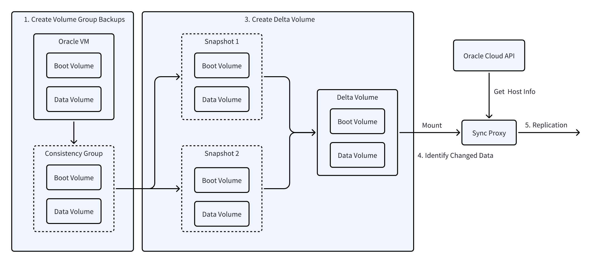

# 数据同步原理

本⽂档旨在详细介绍源端同步的原理，涵盖代理（Agent-based）和无代理（Agentless）两种模式的底层实现技术。作为数据备份与恢复解决方案的核心技术之一，源端同步的效率与可靠性直接影响灾备系统的整体性能。本文将重点解析本产品在这两种模式下的核心实现机制，并深入阐述增量数据获取的原理，以帮助读者更全面地理解数据同步的关键技术。

## Linux Agent

Linux Agent 主要由用户态和内核态模块组成。内核态模块负责捕获 I/O 变化，实时监控文件系统的读写操作；用户态模块则将捕获到的数据通过不同协议传输至目标存储，并管理全量和增量备份的流程。通过内核态和用户态模块的协同工作，Linux Agent 能够高效地执行数据同步和备份任务。

Linux Agent内核模块通过实现写时复制（COW）系统来管理快照并跟踪更改。当首次为块设备初始化时，内核模块会在驱动器上创建一个 COW 数据存储文件。内核模块拦截所有块级写操作，并在写入完成之前将即将被更改的数据复制到快照存储中。通过这种方式，即使写操作正在进行，该模块也可以维护文件系统的完整和一致的快照。快照数据由内核模块通过位于磁盘上 COW 文件开头的索引进行管理和访问。此实现使我们的写时复制系统能够在块级别可靠地维护驱动器的完整时间点镜像，从而比其他方法更稳定和一致。

## Windows Agent

**Windows Agent** 分为两个主要层次：内核态和应用层。

1. **内核态驱动**：负责采集所有被保护磁盘的写入I/O操作，并提供接口供应用层使用。通过两次时间标记，内核驱动能够统计所有写入I/O的序列。
    
2. **应用层**：主要负责读取磁盘块数据并将目标数据写入（如通过iSCSI或OSS）。为提高数据同步效率并解决一致性问题，应用层采用微软的卷影复制服务（VSS）技术，支持创建卷快照并利用写时复制（COW）原理保持快照数据的一致性。
    
3. **快照与同步**：数据同步基于块级别，应用层分析每个被保护磁盘，识别每个卷的起始和结束位置，实现位置映射，从而快速定位读取磁盘的每一块数据。
    
4. **有效数据同步**：应用层仅同步卷中的有效数据。通过读取每个卷的元数据中的位图（bitmap），计算有效和无效数据扇区，系统在数据同步时跳过无效区域，以优化同步过程。

## VMware无代理方式

VMware 无代理方式的数据同步主要通过 VMware 的 Changed Block Tracking (CBT) 技术实现。CBT 是一种高效的虚拟机磁盘变更追踪技术，它能够在增量同步时，识别并捕获自上次同步以来发生变化的磁盘数据块，从而仅同步这些已变更的数据部分，极大提高了备份效率。

通过 vCenter API 或者 ESXi API，系统可以获取主机的元数据信息，如虚拟机配置、磁盘信息和虚拟机运行状态（如电源状态）等。这样，无需在每台主机上安装代理程序，就能够集中管理所有平台中的虚拟机，为后续的数据同步做好准备。

在每次同步之前，为确保磁盘数据的一致性和完整性，系统需要先调用主机的快照接口，创建虚拟机的快照。这一步骤能够确保在同步过程中，磁盘数据保持一致，避免了虚拟机在同步时被修改而导致的同步数据不一致问题。

在增量备份过程中，CBT 机制会标记磁盘中已修改的数据块（Changed Blocks）。通过这种方式，系统能够高效地识别并仅同步这些变化的数据，而无需重新传输整个虚拟机的磁盘内容。这样，不仅节省了带宽和存储空间，还显著减少了备份所需的时间。

## OpenStack Ceph无代理方式

在无代理模式下，基于Ceph存储的OpenStack云平台的数据同步依赖于源端同步代理节点、Ceph存储和OpenStack API接口之间的协作。该同步方式通过增量快照技术，确保数据同步过程高效且带宽利用最大化。以下是该数据同步原理的详细描述：

**注意**：当前该同步模式仅适用于使用Ceph存储并支持RBD连接的OpenStack平台，且OpenStack API未做修改。对于采用商业化存储的OpenStack平台，该模式暂时不支持。

1. 源端同步代理节点

源端同步代理节点需要具备以下两种访问能力：

- **OpenStack API接口访问**：用于获取OpenStack虚拟机的状态信息，执行虚拟机实例的快照操作，以及查询虚拟机的其他相关信息。
- **Ceph存储网络访问**：用于读取Ceph存储池中的元数据信息，特别是Ceph快照的增量数据，通过差异比较来识别和同步变化的数据块。

源端同步代理节点通过OpenStack API获取虚拟机的状态信息并触发快照操作。同时，该节点还需要通过Ceph存储网络获取与快照相关的元数据（包括块设备的版本信息、修改时间戳等），以便进行增量数据的比较和同步。

2. 快照操作

在增量同步过程中，首先，源端同步代理节点会通过OpenStack API接口对目标虚拟机执行快照操作，生成虚拟机当前状态的完整数据快照。接着，系统通过调用Ceph的RBD接口，获取与该快照关联的Ceph快照元数据信息。通过这些元数据，系统能够识别哪些数据块在上次快照之后发生了变化。

3. 差量数据比较

在获取当前快照和上次快照的元数据信息后，系统将对比两者的差异，识别出已发生变化的数据块。差异比较过程基于Ceph增量快照机制，系统通过对比元数据中的版本信息、修改时间戳等特征，精确识别需要同步的数据块。变化的数据块被标识后，源端同步节点将通过Ceph存储网络读取这些数据块的内容，并准备将其同步到目标存储。

4. 数据同步至目标存储

一旦变化的数据块被识别，源端同步代理节点将这些差异数据同步到目标存储。通过增量同步的方式，系统仅同步发生变化的数据，显著降低了带宽需求并减少了不必要的存储占用。此策略确保了数据同步的高效性和最小化的资源消耗。

5. 快照清理

数据同步完成后，源端同步节点会执行快照清理操作。具体而言，它将删除上一次的快照，并保留当前快照，以便用于下一次的差量数据比较。此操作有助于有效释放存储空间，同时确保同步过程的连续性与一致性，避免了存储的冗余与不必要的资源占用。

## AWS无代理方式

AWS EC2 无代理同步模式的优势主要得益于 AWS 云平台提供的 AWS EBS Direct API。这项技术使用户能够在无需安装任何代理的情况下，快速高效地对 EC2 实例进行备份和数据同步。AWS EBS Direct API 的工作原理与 VMware CBT（Changed Block Tracking）有一定的相似性，利用 REST API 提供接口，使得这一功能不仅灵活且易于集成。与传统的代理方式相比，EBS Direct API 无代理备份模式显著降低了操作复杂度，并提升了备份任务的性能。

需要特别指出的是，当前在全球范围内的主要云平台（无论是公有云还是私有云），只有 AWS 提供了这种无代理接口的能力，允许用户在不部署代理程序的情况下，对云主机进行备份和数据同步。这一模式极大简化了运维流程，减少了部署和维护代理的负担，同时也有效降低了对主机性能的影响。

尽管 Oracle Cloud 也提供了类似的解决方案，但其实现方式与 AWS 的有所不同。Oracle Cloud 并没有通过 REST API 提供无代理备份功能，而是通过 SCSI（Small Computer System Interface）协议中的底层特性来实现。这种方式相比于 AWS 的 REST API 方法，在集成和应用上显得更加复杂，且灵活性较差。

对于其他云平台，如微软 Azure、Google Cloud、阿里云、华为云等，当前依然主要依赖代理方式进行数据同步。尽管这些云平台也提供了强大的云存储服务，但它们尚未支持通过 REST API 或类似的无代理技术，直接对云主机进行备份和数据同步。因此，用户在这些平台上进行备份时，仍然需要通过代理来实现增量同步或全量备份。如果要实现无代理的同步方式，需要云平台主动开放相关接口和能力，现阶段其他平台尚无法通过无代理方式进行数据同步。

综上所述，AWS 通过 EBS Direct API 提供的无代理同步模式，是目前唯一支持这一技术的云平台之一。这一创新功能为用户提供了更加便捷、可靠的备份解决方案，同时也推动了无代理备份技术在云计算领域的发展。随着无代理同步技术的成熟，我们有理由相信，未来会有更多的云平台跟随 AWS 的步伐，推动这一技术的普及。

更多详细的内容请参考：[Deep in AWS Agentless Mode](../../../userguide/presales/aws-agentless-mode-cost-calculator.md)

## Huawei FusionCompute无代理方式

Huawei FusionCompute 是一款虚拟化平台，支持通过无代理方式进行数据同步，其增量快照功能与 VMware 的 Changed Block Tracking（CBT）技术相似。FusionCompute 通过 API 和 Socket 接口获取增量快照数据，进而进行数据同步。具体而言，API 用于请求增量快照信息，而 Socket 接口则用于实时传输增量数据。

与 VMware 不同，FusionCompute 并未抽象出虚拟机存储层（Datastore）。VMware通过虚拟化管理程序（hypervisor）直接与虚拟机的磁盘（VMDK）交互，它能够感知虚拟机磁盘的变化并进行增量追踪， 因此在实现增量快照（CBT）时，必须在每台物理主机上安装一个轻量级的 Agent。这个 Agent 负责监控本地主机的存储层，并捕获每个虚拟机的增量变化数据。由于缺少存储层抽象，FusionCompute 依赖主机级 Agent 作为补充来实现类似 VMware 的增量同步功能。

## Oracle Cloud无代理方式

Oracle Cloud提供的无代理备份方案利用SCSI协议的GET LBA STATUS命令实现块级别的差量复制。该方案通过SCSI协议的底层硬件控制能力，精确检测存储卷上的数据块变化。具体实现流程如下：

1. **创建卷组备份**：为确保数据完整性，首先创建主机卷的一致性备份组。
2. **生成增量卷**：基于前后两次备份的OCID，创建包含变更数据块的增量卷。
3. **挂载存储卷**：通过iSCSI协议将增量卷挂载至Linux实例。
4. **识别变更数据并同步**：利用SCSI GET LBA STATUS命令扫描挂载卷，识别并提取变更数据块，并同步至目标存储。
5. **清理资源**：完成同步后，依次执行卷的断开连接、卸载和删除操作。

